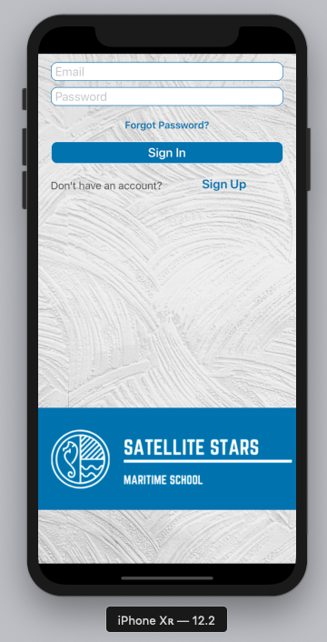
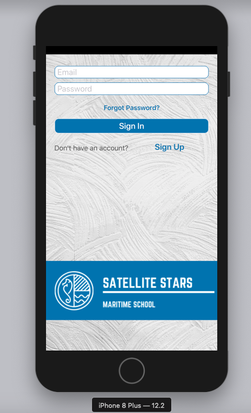
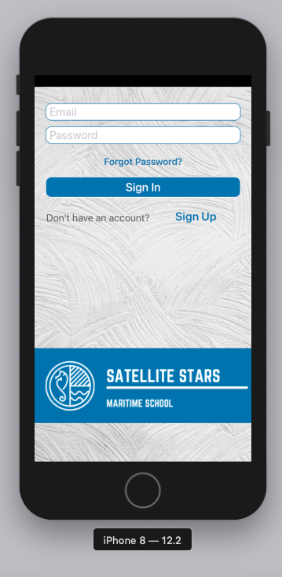
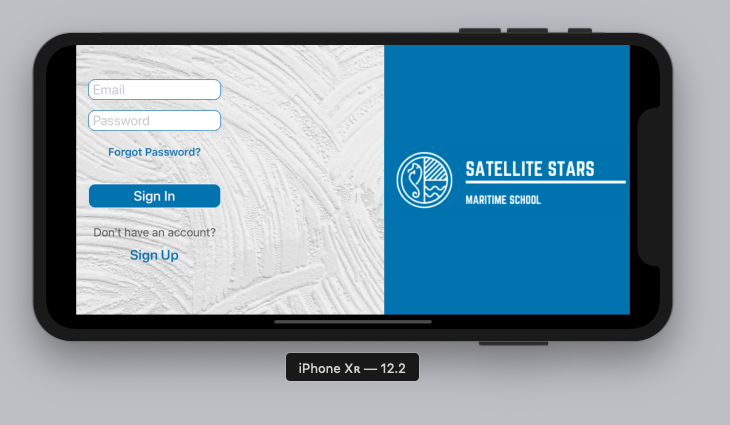
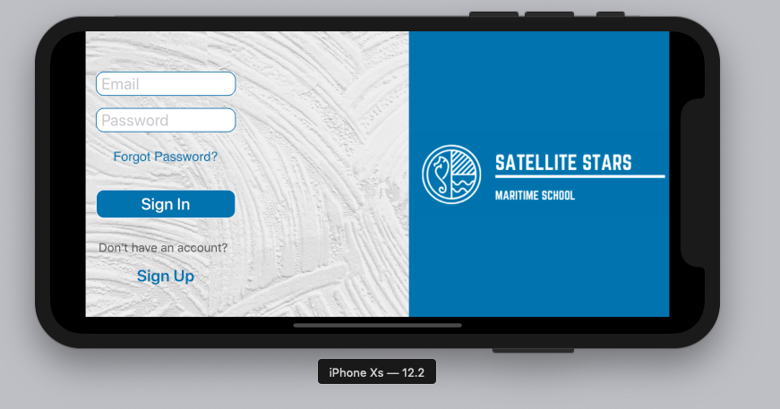
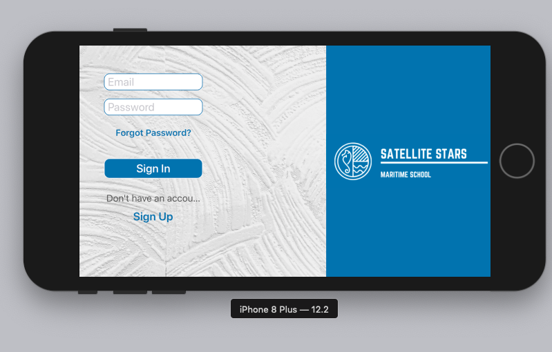
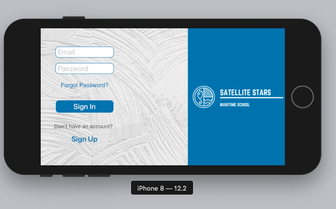
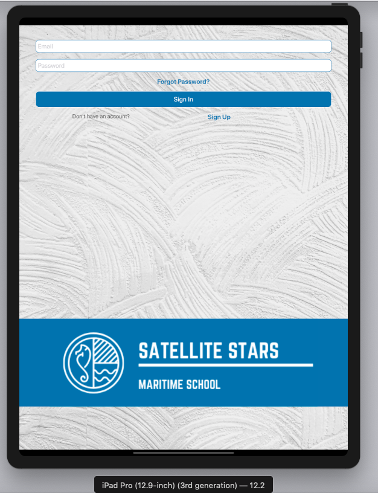

# DemoSizeClasses

In-depth use of size classes/auto-layout in Swift 5 including the Split Screen feature of iPad. Testing the app design on all available iOS devices(simulators).

    

    

  
